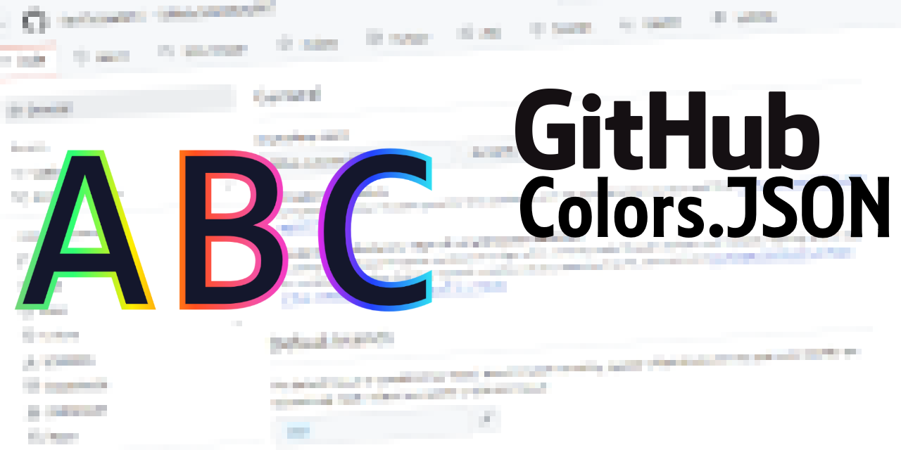

# Github ColorsDotJson

<p align="center">
  
</p>

Userscript that changes display name, additional name, and pronouns color based on separate values in a JSON file from an GitHub repository. 

## Using / Installing

Click [`this link` (https://github.com/PatoFlamejanteTV/Github-ColorsDotJson/raw/refs/heads/main/src/main.user.js)](https://github.com/PatoFlamejanteTV/Github-ColorsDotJson/raw/refs/heads/main/src/main.user.js), it should open the TamperMonkey Import menu, just accept and go to any page that supports this.
## Example

https://github.com/PatoFlamejanteTV/PatoFlamejanteTV/blob/main/color.json
``` json
{
  "nameColor": "#4EC47E",
  "additionalNameColor": "#FFBF18",
  "pronounsColor": "#84574E"
}
```

